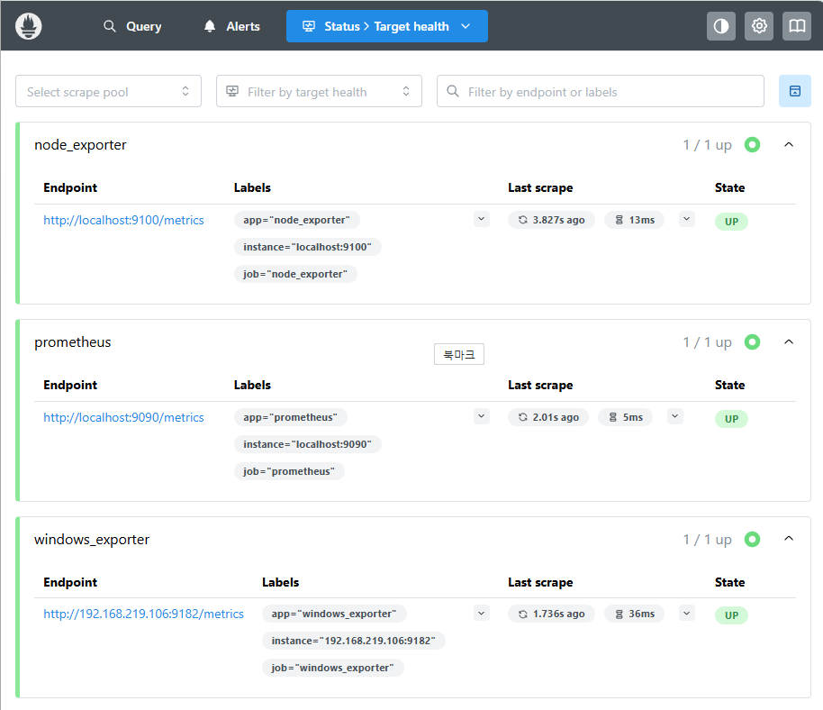
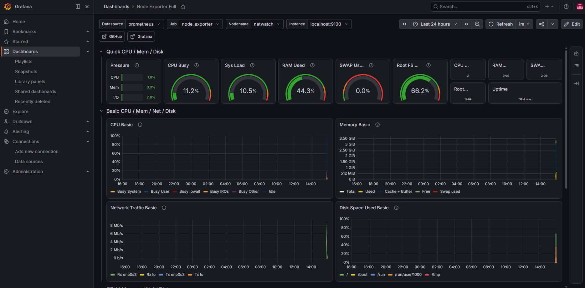
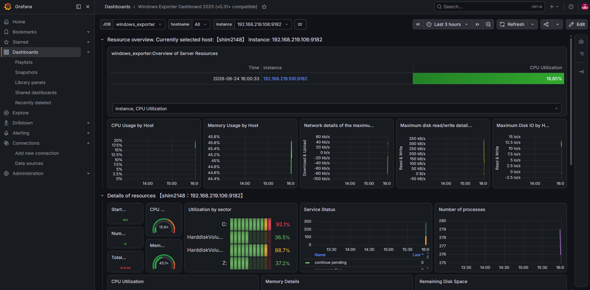
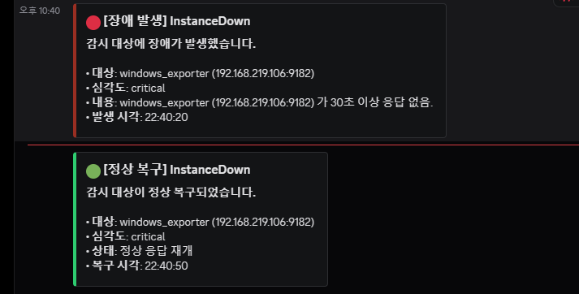

# NetWatch — 통합 인프라 모니터링 시스템

Prometheus + Grafana 기반의 NOC급 실시간 모니터링 스택. 리눅스 서버와 Windows PC를 단일 대시보드에서 통합 감시하고, 장애 발생 시 Discord로 실시간 알림을 보낸다. exporter만 추가하면 감시 대상을 확장할 수 있는 pull 기반 구조로 설계했다.

> 사이버보안 포트폴리오 프로젝트 (NOC/SOC 신입 지원용). 탐지·차단을 담당하는 ML 기반 IPS 프로젝트 **NetGuard**와 함께 "방어 + 운영" 두 축을 구성한다.

---

## 1. 한눈에 보기

| 항목 | 내용 |
|------|------|
| 목적 | 서버·장비 상태를 실시간 수집·시각화하고 장애를 즉시 인지·통보 |
| 핵심 스택 | Prometheus 3.12, Grafana 13, Alertmanager 0.28, node_exporter, windows_exporter |
| 감시 대상 | Ubuntu Server(리눅스), Windows 11 PC — **이기종 통합** |
| 수집 방식 | Prometheus pull (HTTP scrape) |
| 알림 채널 | Discord (Alertmanager discord_configs) |
| 호스트 환경 | VirtualBox VM (Ubuntu Server 26.04 LTS) |

---

## 2. 아키텍처

```
        [ 감시 대상 ]                  [ NetWatch 서버 (Ubuntu VM) ]        [ 출력 ]

  netwatch 서버 (자기 자신) ──┐
   └ node_exporter :9100      │
                              ├──>  Prometheus :9090  ──┬─>  Grafana :3000   ──>  웹 대시보드
  Windows PC ────────────────┘       (수집·저장·평가)    │    (시각화)
   └ windows_exporter :9182                              │
                                                         └─>  Alertmanager :9093 ──>  Discord 알림
                                                              (장애 라우팅·통보)

  ※ exporter만 추가하면 감시 대상 확장 가능 (Linux=node_exporter, Windows=windows_exporter)
```

각 구성요소의 역할:

- **exporter** — 감시 대상에 설치하는 에이전트. 시스템 상태(CPU/메모리/디스크/네트워크)를 HTTP로 노출한다.
- **Prometheus** — 각 exporter를 주기적으로 scrape해 시계열 DB에 저장하고, 알림 규칙을 평가하는 중앙 엔진.
- **Grafana** — Prometheus의 데이터를 그래프·게이지 대시보드로 시각화.
- **Alertmanager** — Prometheus가 발동한 알림을 받아 라우팅하고 Discord로 통보.

---

## 3. 구축 과정

> 아래 예시의 `<NETWATCH_SERVER_IP>`, `<WINDOWS_PC_IP>`는 실제 환경의 IP로 치환해 사용한다.

### 3-1. 기반 환경

- VirtualBox에 **Ubuntu Server 26.04 LTS** 설치
- 네트워크를 **브리지 어댑터**로 구성해 호스트와 동일 대역 확보 → 외부 접근 가능
- OpenSSH 설치 후 원격 SSH 접속으로 작업

### 3-2. Prometheus (수집·저장·평가 엔진)

```bash
# 전용 계정 및 디렉터리
sudo useradd --no-create-home --shell /bin/false prometheus
sudo mkdir /etc/prometheus /var/lib/prometheus

# 공식 바이너리 설치 (v3.12.0)
cd /tmp
wget https://github.com/prometheus/prometheus/releases/download/v3.12.0/prometheus-3.12.0.linux-amd64.tar.gz
tar xvf prometheus-3.12.0.linux-amd64.tar.gz
cd prometheus-3.12.0.linux-amd64
sudo cp prometheus promtool /usr/local/bin/
sudo cp prometheus.yml /etc/prometheus/
sudo chown -R prometheus:prometheus /usr/local/bin/prometheus /usr/local/bin/promtool /etc/prometheus /var/lib/prometheus
```

- 전용 시스템 계정(no-login)으로 권한 분리 → 보안 강화
- **systemd 서비스로 등록**해 부팅 시 자동 실행, `0.0.0.0:9090` 노출

### 3-3. node_exporter (리눅스 센서)

- v1.11.1 설치, 전용 계정 + systemd 서비스로 등록
- `prometheus.yml`에 scrape 대상 추가

```yaml
  - job_name: "node_exporter"
    static_configs:
      - targets: ["localhost:9100"]
        labels:
          app: "node_exporter"
```

### 3-4. Grafana (시각화)

```bash
sudo apt-get install -y apt-transport-https software-properties-common wget
sudo mkdir -p /etc/apt/keyrings
sudo wget -O /etc/apt/keyrings/grafana.asc https://apt.grafana.com/gpg-full.key
echo "deb [signed-by=/etc/apt/keyrings/grafana.asc] https://apt.grafana.com stable main" | sudo tee /etc/apt/sources.list.d/grafana.list
sudo apt-get update && sudo apt-get install -y grafana
sudo systemctl enable --now grafana-server
```

- Prometheus를 데이터소스로 연결
- **Node Exporter Full** 대시보드(ID 1860) import → 리눅스 모니터링 화면 완성

### 3-5. Windows PC 통합 (이기종 확장)

- Windows PC에 **windows_exporter** 0.31.7(.msi) 설치 → 서비스 자동 등록, :9182 노출
- Windows 방화벽에 9182 인바운드 허용:

```powershell
New-NetFirewallRule -DisplayName "windows_exporter" -Direction Inbound -Protocol TCP -LocalPort 9182 -Action Allow
```

- `prometheus.yml`에 Windows PC를 scrape 대상으로 추가

```yaml
  - job_name: "windows_exporter"
    static_configs:
      - targets: ["<WINDOWS_PC_IP>:9182"]
        labels:
          app: "windows_exporter"
```

- **Windows Exporter Dashboard 2025**(v0.31 호환) import → Windows 모니터링 화면 완성

### 3-6. Alertmanager + Discord 알림

```bash
# 설치 (v0.28.1) — 전용 계정 + systemd 등록
cd /tmp
wget https://github.com/prometheus/alertmanager/releases/download/v0.28.1/alertmanager-0.28.1.linux-amd64.tar.gz
tar xvf alertmanager-0.28.1.linux-amd64.tar.gz
cd alertmanager-0.28.1.linux-amd64
sudo cp alertmanager amtool /usr/local/bin/
sudo useradd --no-create-home --shell /bin/false alertmanager
sudo mkdir -p /etc/alertmanager /var/lib/alertmanager
sudo chown -R alertmanager:alertmanager /usr/local/bin/alertmanager /usr/local/bin/amtool /etc/alertmanager /var/lib/alertmanager
```

**Alertmanager 설정** (`/etc/alertmanager/alertmanager.yml`) — Discord 네이티브 연동:

```yaml
global:
  resolve_timeout: 5m

route:
  receiver: 'discord'
  group_wait: 10s
  group_interval: 1m
  repeat_interval: 1h

receivers:
  - name: 'discord'
    discord_configs:
      - webhook_url: '<DISCORD_WEBHOOK_URL>'   # 실제 URL은 커밋 금지
        send_resolved: true
```

**Prometheus 알림 규칙** (`/etc/prometheus/rules.yml`):

```yaml
groups:
  - name: netwatch_alerts
    rules:
      - alert: InstanceDown
        expr: up == 0
        for: 30s
        labels:
          severity: critical
        annotations:
          summary: "🚨 NetWatch: 감시 대상 다운"
          description: "{{ $labels.job }} ({{ $labels.instance }}) 가 30초 이상 응답 없음."
```

`prometheus.yml`의 `alerting`·`rule_files` 섹션을 활성화해 Alertmanager(`localhost:9093`)와 규칙 파일을 연결한 뒤, `promtool check config`로 검증하고 재시작한다.

→ 감시 대상이 30초 이상 응답하지 않으면 Discord로 **🔴 FIRING**, 복구되면 **🟢 RESOLVED** 알림이 자동 발송된다.

---

## 4. 트러블슈팅 기록

실제 구축 중 마주친 문제와 해결 과정.

| 문제 | 원인 | 해결 |
|------|------|------|
| VirtualBox VM 부팅 실패 (`VERR_NEM_VM_CREATE_FAILED`) | Windows Hyper-V가 CPU 가상화 점유 | `bcdedit /set hypervisorlaunchtype off` 후 재부팅 |
| 원격 SSH 접속 불가 | sshd 서비스 미실행 | `systemctl enable --now ssh`로 활성화 + 부팅 자동실행 등록 |
| VM이 NAT IP 할당 | 네트워크 어댑터가 NAT 모드 | 브리지 어댑터로 변경해 동일 대역 IP 확보 |
| windows_exporter 타겟 `UNKNOWN`(scrape 실패) | Windows 방화벽이 9182 인바운드 차단 | `New-NetFirewallRule`로 9182 인바운드 허용 |
| Grafana 대시보드 ID import 실패 | VM이 grafana.com 외부 접속 불가(폐쇄망) | 대시보드 JSON을 직접 다운로드해 업로드 방식으로 우회 |
| Discord 알림 발송 실패 (`400 {"attachments":["0"]}`) | Slack 웹훅 호환(`/slack`) 방식이 Discord의 attachments 포맷과 불일치 | Alertmanager 0.26+ 네이티브 **`discord_configs`**(`webhook_url`)로 전환 |

> 마지막 항목은 `journalctl -u alertmanager` 로그로 실패 원인(400 에러)을 격리한 뒤 올바른 연동 방식을 찾아 해결한 사례.

---

## 5. 결과물

리눅스 서버 + Windows PC의 CPU·메모리·디스크·네트워크를 실시간 모니터링하고, 장애를 Discord로 즉시 통보한다.

### Prometheus Targets — 전 대상 UP


### Grafana — 리눅스 서버 대시보드 (Node Exporter Full)


### Grafana — Windows PC 대시보드 (Windows Exporter 2025)


### Discord 실시간 알림 — 장애(FIRING) / 복구(RESOLVED)


---

## 6. 배운 점

- Prometheus pull 기반 모니터링의 동작 원리와 확장 구조
- systemd 서비스 등록, 전용 계정 권한 분리 등 리눅스 서버 운영 기본
- 이기종(Linux/Windows) 환경을 단일 스택으로 통합하는 방법
- Prometheus → Alertmanager → 알림 채널로 이어지는 경보 파이프라인 설계
- 로그 기반 장애 격리: 파이프라인을 구간별로 끊어 어디서 실패하는지 진단
- 방화벽 포트, 폐쇄망 등 실제 운영 환경에서 발생하는 네트워크 트러블슈팅
- 모니터링 시스템 구축 시 기술 구현뿐 아니라 **접근 권한·동의 범위**를 함께 고려해야 함

---

## 7. 향후 확장

- [x] Alertmanager + Discord 연동으로 장애 발생 시 실시간 알림
- [ ] GNS3 가상 네트워크 노드 추가 감시 (SNMP)
- [ ] 고정 IP 설정 및 인증(reverse proxy) 적용

---

## ⚠️ 보안 주의

이 저장소는 **구축 문서·설정 예시**만 공개한다. 실제 운영 시스템은 다음 이유로 공개망에 노출하지 않는다.

- Prometheus·exporter 엔드포인트는 인증이 없어 시스템 내부 정보가 그대로 노출됨 (공격자 정찰에 악용 가능)
- Grafana는 인증·접근 제어, 방화벽 화이트리스트, reverse proxy 적용 후에만 외부 노출을 고려해야 함
- **Discord 웹훅 URL은 비밀번호에 준하는 민감 정보**이므로 저장소에 커밋하지 않는다 (`.gitignore`로 차단)
- 저장소에는 실제 IP·비밀번호·웹훅 URL 등 민감 정보를 포함하지 않는다
